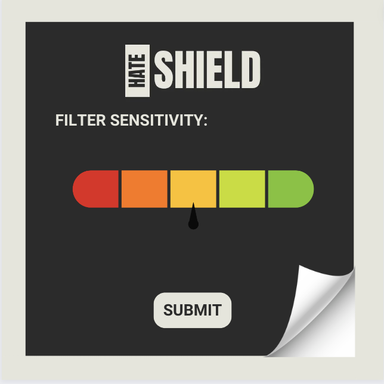
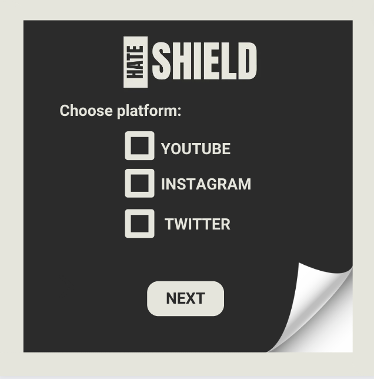

# HateShield: A Chrome Extension for Blocking Hate Speech


HateShield is a Chrome extension that utilizes advanced Natural Language Processing (NLP) techniques to shield users from hate speech on social media platforms. By classifying comments as hate speech or normal, it creates a safer online environment by filtering out racist, sexist, homophobic comments, and general profanity according to user preferences.

## Features

- **Customizable Filtering:** Users can select on which platforms u want to plot the comments
- **NLP Classification:** Leveraging state-of-the-art NLP models to accurately identify hate speech.
- **User-Friendly Interface:** Simple and intuitive interface for a seamless user experience.
- **Accuracy:** more accurate and consistent than competitors in the market
## How it works
1. Platform Selection: Users can choose the social media platforms where they want to apply the comment blocking functionality, such as YouTube, Instagram, or Twitter.
2. Filtering Sensitivity: Users can select the intensity level of the hate comment filtering, ranging from low to high sensitivity, to match their desired level of protection.
3. NLP Analysis: The extension utilizes advanced Natural Language Processing (NLP) techniques to analyze comments displayed on the screen in real-time, using the BART ai model
4. Keyword Matching: Comments are compared against a pre-defined dataset containing keywords related to profanity, violence, sexual content, misogyny, transphobia, racial slurs, and other offensive categories, 5. including hindi slurs and abuses written in english.
5. Overwriting Comments: If a comment matches any of the predefined categories, it is overwritten with a standardized message, such as "This comment was suspended beacuse deemed <category>."
6. Customization: Users have the flexibility to add or remove keywords from the blocked list, allowing them to fine-tune the filtering criteria according to their preferences.




## Installation

1. Clone the repository to your local machine.
   ```sh
   git clone https://github.com/yourusername/hateshield.git
